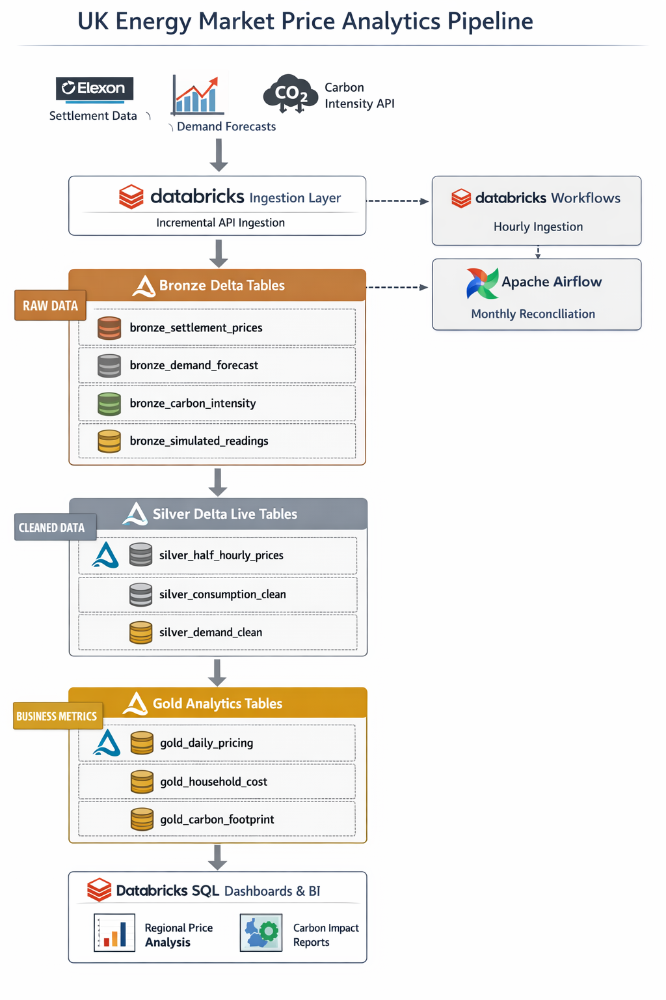

# UK Energy Market Price Analytics Lakehouse  
*A Cloud-Native Databricks Lakehouse for UK Electricity Pricing, Consumption & Carbon Analytics*

This project implements a **production-grade energy analytics data platform** designed to process, enrich, and analyze **UK electricity market pricing and consumption data** at scale. The pipeline ingests near real-time market settlement prices from **Elexon**, enriches them with **carbon intensity data** and **simulated smart meter readings**, and delivers analytics-ready datasets for **pricing analysis, cost modelling, and sustainability insights**.

The architecture follows a **modern Lakehouse pattern** using **Databricks, Delta Live Tables, Unity Catalog, and PySpark**, with clear **Bronze / Silver / Gold** separation, automated data quality enforcement, and scalable orchestration.

This use case aligns with:
- **Energy & Utilities** providers analysing real-time pricing and demand
- **Public sector organisations ** linking property energy performance to valuation and sustainability metrics
- **Carbon reporting & net-zero initiatives**

---

## Architecture Overview

         ┌──────────────────────────────┐
         │        External APIs          │
         │  • Elexon Settlement Prices   │
         │  • Demand Forecasts           │
         │  • Carbon Intensity API       │
         └───────────────┬──────────────┘
                         │
                         ▼
         ┌──────────────────────────────┐
         │ Databricks Ingestion Layer    │
         │ (Python / PySpark Notebooks) │
         │ Incremental API Pulls         │
         └───────────────┬──────────────┘
                         ▼
         ┌──────────────────────────────┐
         │ Bronze Delta Tables           │
         │ Raw JSON, Append-Only         │
         │ Timestamp Watermarking        │
         └───────────────┬──────────────┘
                         ▼
         ┌──────────────────────────────┐
         │ Silver Delta Live Tables      │
         │ Cleaned, Validated, Deduped  │
         │ Data Quality Expectations     │
         └───────────────┬──────────────┘
                         ▼
         ┌──────────────────────────────┐
         │ Gold Analytics Tables         │
         │ Pricing, Cost & Carbon KPIs  │
         │ Optimized for BI & SQL        │
         └───────────────┬──────────────┘
                         ▼
         ┌──────────────────────────────┐
         │ Databricks SQL Dashboards     │
         │ Regional Pricing & Insights  │
         └──────────────────────────────┘

---

## Key Features

### UK Electricity Market Data Ingestion
- Ingests **half-hourly settlement prices** from the **Elexon API**
- Pulls **demand forecasts** and **carbon intensity metrics**
- Uses **incremental loads with watermarks** to ensure idempotent processing
- Raw API responses stored in **Bronze Delta tables** for auditability

### Smart Meter Consumption Simulation
- Generates realistic household consumption data:
  - 10,000+ simulated households
  - Time-of-use patterns (peak / off-peak / overnight)
  - Postcode-sector level granularity
- Enables cost modelling without access to real smart meter data
- Joined with settlement prices to calculate **household energy costs**

### Lakehouse Medallion Architecture
- **Bronze**: Raw JSON, schema-on-read, 90-day retention
- **Silver**: Cleaned, deduplicated, validated datasets with enforced constraints
- **Gold**: Pre-aggregated business metrics optimised for analytics & BI

### Advanced PySpark Transformations
- Window functions for:
  - Rolling 7-day and 30-day price averages
  - Peak vs off-peak consumption trends
- Time-series aggregations for:
  - Daily regional pricing
  - Demand vs forecast accuracy
- Cost and carbon calculations at **postcode-sector level**

---

## Tech Stack

| Layer | Technology | Purpose |
|------|-----------|---------|
| **Cloud Platform** | Databricks | Unified analytics & compute |
| **Storage Format** | Delta Lake | ACID, versioned lakehouse tables |
| **Processing** | PySpark | Distributed ETL & analytics |
| **Data Quality** | Delta Live Tables | Expectations & pipeline reliability |
| **Governance** | Unity Catalog | Secure, governed data access |
| **Orchestration** | Databricks Workflows | Hourly ingestion pipelines |
| **Advanced Scheduling** | Apache Airflow | Monthly reconciliation dependencies |
| **BI & Analytics** | Databricks SQL | Dashboards & ad-hoc analysis |
| **Language** | Python | ETL logic & simulations |
| **APIs** | Elexon, Carbon Intensity | UK energy market data |

---

## Data Model

### Bronze Layer (Raw)
Stored in `energy_analytics.bronze_raw`

| Table | Description |
|-----|-------------|
| bronze_settlement_prices | Raw half-hourly settlement price JSON |
| bronze_demand_forecast | Raw demand forecast data |
| bronze_carbon_intensity | Carbon intensity by region |
| bronze_simulated_meter_readings | Simulated household smart meter data |

Retention: **90 days**  
Load Type: **Append-only, incremental**

---

### Silver Layer (Cleaned & Validated)
Stored in `energy_analytics.silver_cleaned`

| Table | Description |
|------|-------------|
| silver_half_hourly_prices | Cleaned settlement prices |
| silver_consumption_clean | Validated household consumption |
| silver_demand_clean | Forecast vs actual demand |
| silver_postcode_mapping | Postcode-sector enrichment |

**Data Quality Rules**
- `price > 0`
- Valid settlement timestamps
- Known UK postcode sectors only
- Deduplication on `(settlement_period, region)`

---

### Gold Layer (Business Analytics)
Stored in `energy_analytics.gold_business`

| Table | Description |
|------|-------------|
| gold_daily_regional_pricing | Daily avg / peak / off-peak prices |
| gold_household_cost_analysis | Energy cost per household & postcode |
| gold_carbon_footprint_by_area | Carbon impact by postcode sector |

Optimized using:
- **Z-ORDER BY (date, postcode)**
- Pre-aggregations for BI performance

---

## Orchestration Strategy

### Databricks Workflows
- Hourly ingestion of:
  - Settlement prices
  - Demand forecasts
  - Carbon intensity
- Automatic retries and failure alerts
- Cost-efficient single-node ingestion clusters

### Apache Airflow (Advanced Dependencies)
- Monthly reconciliation DAG:
  - Waits for all daily jobs to complete
  - Produces billing-period summaries
- Handles complex inter-pipeline dependencies beyond native workflows

---

## Cluster Strategy

| Cluster Type | Configuration | Purpose |
|-------------|---------------|---------|
| Ingestion | Single-node | API calls & lightweight parsing |
| Transformation | Autoscaling (3–8 workers) | PySpark ETL & aggregations |
| Serving | SQL Warehouse (Serverless) | BI dashboards & ad-hoc SQL |

---

## Analytics & Business Value

- **Regional electricity price variation analysis**
- **Household energy cost modelling**
- **Peak vs off-peak consumption insights**
- **Carbon footprint tracking by postcode**
- **Supports policy, pricing & sustainability decisions**

---

## Project Outcomes

This project demonstrates:
- End-to-end **lakehouse architecture design**
- Scalable **cloud-native data engineering**
- Strong **data modelling & governance**
- Real-world **energy & public sector analytics use cases**

It mirrors how modern data platforms are built in **utilities, government, and regulated industries**, balancing **performance, cost, and data quality**.

---

*This repository showcases production-level data engineering practices using Databricks, Delta Lake, and PySpark to deliver reliable, analytics-ready energy market insights.*
